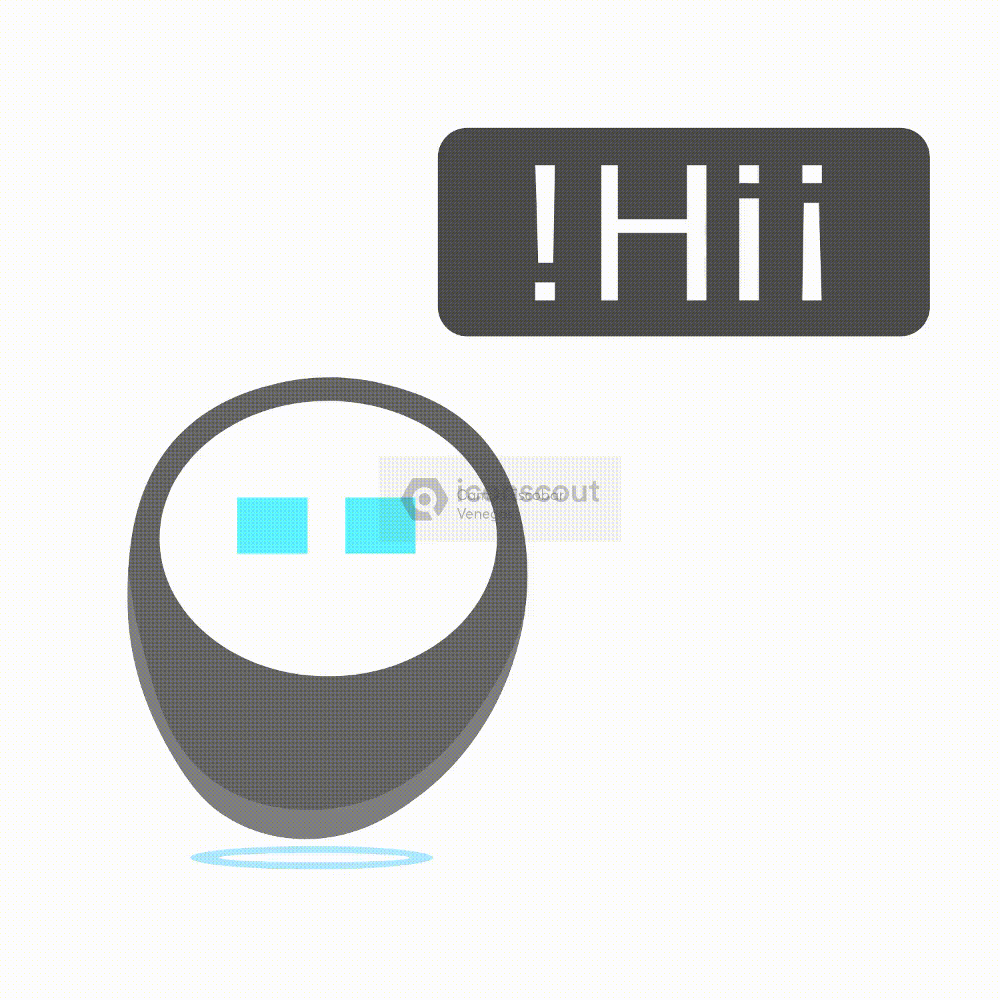

# Hello World !

<table border="0">
<tr>
<td>

</td>

<td>

I’m Vijay Aditya from IIT (BHU), Varanasi, working at the intersection of software engineering and AI.  
I enjoy building scalable systems, intelligent applications, and production-ready AI solutions.

**`Code, data, AI — crafted into real-world systems`**

</td>
</tr>
</table>

## 🧰 Languages and Tools

## 👨‍💻 What I Work On

## 📖 Learning

## Connect With Me

